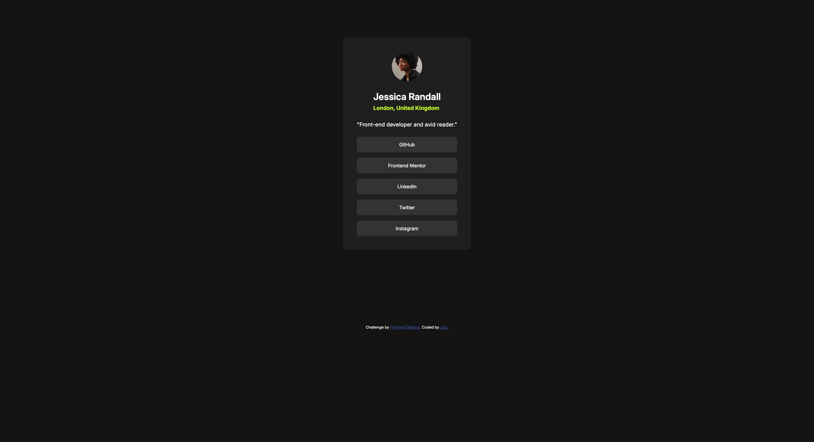

# Frontend Mentor - Social links profile solution

This is a solution to the [Social links profile challenge on Frontend Mentor](https://www.frontendmentor.io/challenges/social-links-profile-UG32l9m6dQ). Frontend Mentor challenges help you improve your coding skills by building realistic projects. 

## Table of contents

- [Overview](#overview)
  - [The challenge](#the-challenge)
  - [Screenshot](#screenshot)
- [My process](#my-process)
  - [Built with](#built-with)
  - [What I learned](#what-i-learned)
  - [Continued development](#continued-development)
  - [Useful resources](#useful-resources)
- [Author](#author)

**Note: Delete this note and update the table of contents based on what sections you keep.**

## Overview

### The challenge

Users should be able to:

- See hover and focus states for all interactive elements on the page

### Screenshot

## My process

### Built with

- Semantic HTML5 markup
- CSS custom properties
- Flexbox
- CSS Grid

### What I learned

Since the first coding challenge with Front End Mentor, I've been using grid to center the component.
I want to add a small learning for each project, so this is the first one when I'm actually filling in the README file. I'll strive to do the same with every upcoming project.

### Continued development

I looked up how to add the effect to the buttons on hover. As this is a beginner challenge, I decided not to bother with at the moment.
I may come back later and complete that part as well.

## Author

- Website (currently it's UX only and under construction) - [Lilla Main](https://lillamain.com/)
- Frontend Mentor - [@yourusername](https://www.frontendmentor.io/profile/yourusername)
- LinkedIn - [Profile](https://www.linkedin.com/in/lilla-k-main/)
